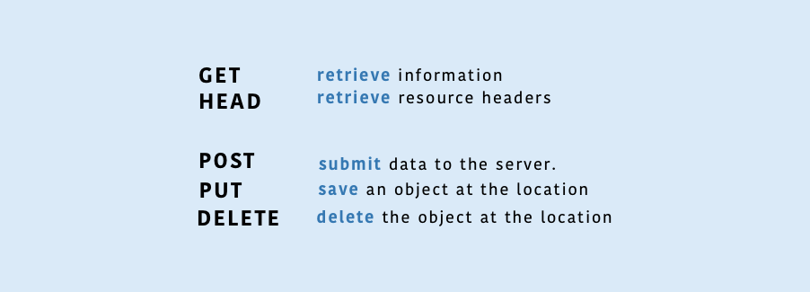

# ISDe course
## Web development
### Maura Pintor - [maura.pintor@unica.it](mailto:maura.pintor@unica.it)

---

What this lesson covers:

Note: we are not going to start from scratch. We are going to clone a 
repository that contains the structure of our code.

What we have:
* requirements
* the definition of the APIs that we need to implement
* the code for the classifier is already written, we are going to use it 
as a **black box**. This means that we know what is the input and the expected 
output, but we are not going to look inside the code.

---

## Part 0 : Web servers basics

---

### Web server for the user

More info [here](https://en.wikipedia.org/wiki/Web_server).

---

### Web server for the developer

More info [here](https://en.wikipedia.org/wiki/Front_and_back_ends).

---

### API

More info [here](https://en.wikipedia.org/wiki/Application_programming_interface).

---

### HTTP

More info [here](https://en.wikipedia.org/wiki/Hypertext_Transfer_Protocol).

---

### The language of web servers

---

### Localhost

More info [here](https://en.wikipedia.org/wiki/Localhost).

---

### Deployment

deploy resources = make them ready to be used

## 1.Define the service

First, we have to define what we want to build. Our **requirements** are: 

* **a web app (frontend) that runs a simple ML algorithm for image classification (backend)**
* inside a container - don't worry about it now
* time constaint (always take into account)

### Before start writing the code ...

This is an important part of our development process. We can start writing code 
right away, but the risk is that if we don't have the right start we might have 
to rewrite the code many times. It is better to take a moment to think about 
the structure of our application. 

#### Use cases and architecture

The user should be able to send a request for an image classification job. 
A thing that we want to consider is that the user expects a quick response 
from the server. Remember, it's not necessary to provide the result already, 
but we need to tell the user we heard him. If we don't do so, the user might 
get annoyed (in the meanwhile the server cannot respond because it is running 
the job) and send multiple requests. We want to avoid that.

What is the solution? We should use **asyncronous** jobs. We create a **queue**, 
save the request, and send the results back to the user when they are 
ready. We will use [Redis](https://redis.io/) for handling the queue.

The webserver enqueues the job and returns to the user a "ticket" for 
getting the results, when they are ready. The "ticket" will be the 
ID of the job.

The worker, another service of our webserver, takes the enqueued jobs 
with a FIFO (First-In-First-Out) schedule, processes the requests, and 
stores the results in redis, with the job ID as Key for accessing the 
newly-produced data.

After some (short) time, the user should be able to send a request to 
the server, providing the job id, and getting the results as a response.

What is the advantage of having modularity and forcing ourselves to 
separate every component? It will be easier, if we have too many requests, 
to scale up the services!

Finally, it is important to provide help for the user in order to allow 
exploration of the service. We might want to implement an additional API 
that returns the list of possible resources available. We will keep it 
simple and just store a list of all models and images available in our 
server.

---

